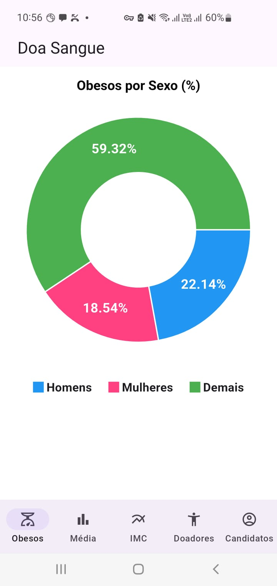

# DoaSang
Sistema de testes para administração de candidatos a doadores de sangue

O repositório está dividido em duas pastas: API e APP.

API

Escrita em Spring Boot, usando banco de dados MySql. Expõe no formato REST/JSON os dados consolidados de uma lista de candidatos a doadores de sague, conforme requisitos especificados.

Observações:

- Arquivo data.sql possui alguns scripts DDL para geração automática de objetos no banco de dados.
- O banco de dados é criado automaticamente no MySQL na primeira vez em que a API é executada.
- Um usuário "usuario1" com senha "password" é criado automaticamente no banco.
- A autenticação de usuários é feita mediante verificação de existência em tabela da base de dados.
- O consumo da API é autorizado mediante token JWT emitido no endpoint /auth/login.
- As informações consolidadas, uma vez geradas, são armazenadas em cache para melhor performance.
- Algumas queries foram feitas em HQL, outras em SQL nativo.
- API foi desenvolvida na IDE Spring Tool Suit 4 (STS) em Java.
- Swagger está integrado para testes dos endpoints (http://localhost:8080/doasang/api/v1/swagger-ui/index.html)
- Gerenciador de pacotes utilizado: Maven.

APP

- O arquivo JSON payload_candidatos está na pasta "/assets".
   - Ele é enviado pelo APP para a API na primeira execução.

- O arquivo de configuração /lib/layers/application/helpers/app_config.dart possui informações importantes:
  * Usuário e senha de autenticação para a API.
  * IP da API (constante URL_API_DEV). Importante especificar corretamente.

- O APP foi desenvolvido no Android Studio.
- Foi utilizada a biblioteca fl_chart para os gráficos.
- O State Management utilizado no Flutter foi o "Provider".

## Screenshots

Aqui estão as imagens das telas:

